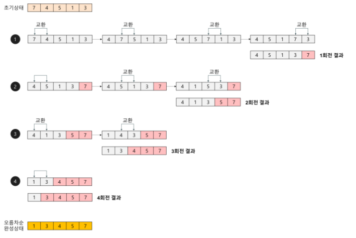
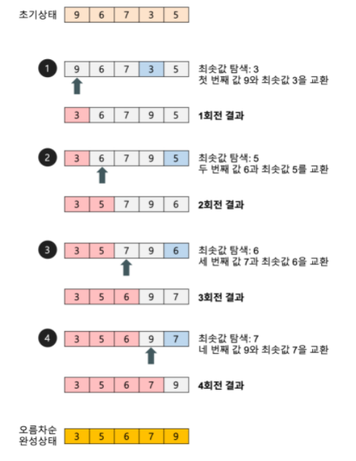
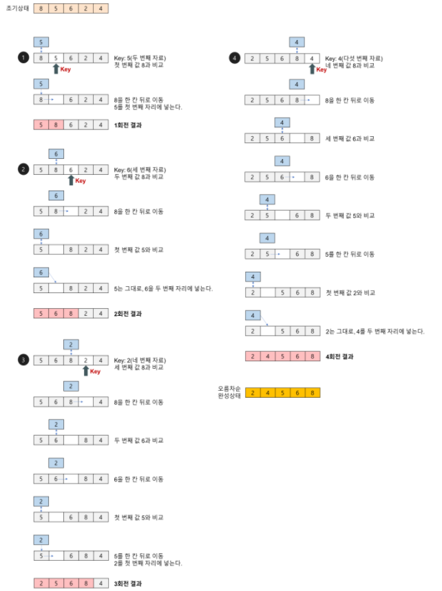
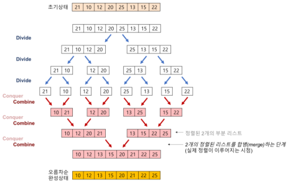
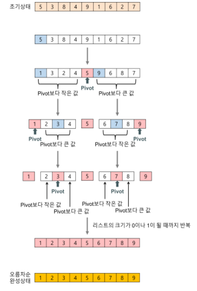

## 정렬 (Sorting)

- 배열 내 원소들을 번호순이나 사전 순서와 같이 일정한 순서대로 열거하는 알고리즘
- 대표 정렬 알고리즘 별 구현 함수
    - 거품 정렬(Bubble Sort) : bubbleSort_1(), bubbleSort_2(), bubbleSort_3(), bubbleSort(),
    - 선택 정렬(Selection Sort) : selectionSort()
    - 삽입 정렬(Insertion Sort) : insertionSort()
    - 병합 정렬(Merge Sort) : mergeSort()
    - 퀵 정렬(Quick Sort) : quickSort()
    - 공통함수 : swap(), ascending(), descending()
    

### 거품 정렬(Bubble Sort)

- 서로 인접한 두 원소를 비교하면서 정렬하는 알고리즘
- 평균 시간 복잡도 : O(n^2)
- 알고리즘 동작 방식



- 거품 정렬 구현

```jsx
// Bubble Sort
let swap = function (arr, idx_1, idx_2) {
  let tmp = arr[idx_1];
  arr[idx_1] = arr[idx_2];
  arr[idx_2] = tmp;
};

let bubbleSort_1 = function (arr) {
  for (let i = 0; i < arr.length - 1; i++) {
    for (let j = 0; j < arr.length - 1; j++) {
      if (arr[j] > arr[j + 1]) {
        swap(arr, j, j + 1);
      }
    }
  }
};

let bubbleSort_2 = function (arr) {
  for (let i = 0; i < arr.length - 1; i++) {
    for (let j = 0; j < arr.length - i - 1; j++) {
      if (arr[j] > arr[j + 1]) {
        swap(arr, j, j + 1);
      }
    }
  }
};

let bubbleSort_3 = function (arr) {
  let swapped;
  for (let i = 0; i < arr.length - 1; i++) {
    swapped = false;
    for (let j = 0; j < arr.length - i - 1; j++) {
      if (arr[j] > arr[j + 1]) {
        swap(arr, j, j + 1);
        swapped = true;
      }
    }
    if (!swapped) break;
  }
};

/* test code */
let init_array = [6, 5, 1, 3, 2, 4];
let array = [...init_array];
bubbleSort_1(array);
console.log(array);
array = [...init_array];
bubbleSort_2(array);
console.log(array);
array = [...init_array];
bubbleSort_3(array);
console.log(array);

/////////////////////////////////////////////////////////////

let swap = function (arr, idx_1, idx_2) {
  let tmp = arr[idx_1];
  arr[idx_1] = arr[idx_2];
  arr[idx_2] = tmp;
};

let ascending = function (x, y) {
  return x > y;
};

let descending = function (x, y) {
  return x < y;
};

let bubbleSort = function (arr, compare) {
  for (let i = 0; i < arr.length - 1; i++) {
    for (let j = 0; j < arr.length - i - 1; j++) {
      if (compare(arr[j], arr[j + 1])) {
        swap(arr, j, j + 1);
      }
    }
  }
};

/* test code */
let init_array = [6, 5, 1, 3, 2, 4];
let array;
let sorting = [bubbleSort];
let order = [ascending, descending];
for (let i = 0; i < sorting.length; i++) {
  for (let j = 0; j < order.length; j++) {
    console.log(sorting[i].name, order[j].name);
    array = [...init_array];
    sorting[i](array, order[j]);
    console.log(array);
  }
}
```

### 선택 정렬(Selection Sort)

- 최솟값을 찾아 데이터 영역의 가장 앞으로 이동하는 방식을 반복하여 전체 데이터 영역을 정렬하는 알고리즘
- 평균 시간 복잡도 : O(n^2)
- 알고리즘 동작 방식



- 선택 정렬 구현

```jsx
let swap = function (arr, idx_1, idx_2) {
  let tmp = arr[idx_1];
  arr[idx_1] = arr[idx_2];
  arr[idx_2] = tmp;
};
let ascending = function (x, y) {
  return x > y;
};
let descending = function (x, y) {
  return x < y;
};
let selectionSort = function (arr, compare) {
  for (let i = 0; i < arr.length; i++) {
    let k = i;
    for (let j = i + 1; j < arr.length; j++) {
      if (compare(arr[k], arr[j])) k = j;
    }
    swap(arr, i, k);
  }
};

/* test code */
let init_array = [6, 5, 1, 3, 2, 4];
let array;
let sorting = [selectionSort];
let order = [ascending, descending];
for (let i = 0; i < sorting.length; i++) {
  for (let j = 0; j < order.length; j++) {
    console.log(sorting[i].name, order[j].name);
    array = [...init_array];
    sorting[i](array, order[j]);
    console.log(array);
  }
}
```

### 삽입 정렬 (Insertion Sort)

- 이미 정렬된 데이터 영역과 비교하면서, 자신의 위치를 찾아 요소를 삽입하며 정렬하는 알고리즘
- 평균 시간 복잡도 : O(n^2)
- 알고리즘 동작 방식



- 삽입 정렬 구현

```jsx
let swap = function (arr, idx_1, idx_2) {
  let tmp = arr[idx_1];
  arr[idx_1] = arr[idx_2];
  arr[idx_2] = tmp;
};

let ascending = function (x, y) {
  return x > y;
};

let descending = function (x, y) {
  return x < y;
};

let insertionSort = function (arr, compare) {
  for (let i = 1; i < arr.length; i++) {
    let tmp = arr[i];
    let j;
    for (j = i - 1; j >= 0; j--) {
      arr[j + 1] = arr[j];
      if (compare(tmp, arr[j])) {
        break;
      }
    }
    arr[j + 1] = tmp;
  }
};

/* test code */
let init_array = [6, 5, 1, 3, 2, 4];
let array;
let sorting = [selectionSort];
let order = [ascending, descending];
for (let i = 0; i < sorting.length; i++) {
  for (let j = 0; j < order.length; j++) {
    console.log(sorting[i].name, order[j].name);
    array = [...init_array];
    sorting[i](array, order[j]);
    console.log(array);
  }
}
```

### 병합 정렬 (Merge Sort)

- 하나의 배열을 두 개의 균등한 크기로 분할하고, 부분 정렬하며, 이를 다시 합하면서 전체를 정렬해가는 알고리즘
- 평균 시간 복잡도 : O(n log n)
- 알고리즘 동작 방식



- 병합 정렬 구현

```jsx
let mergeSort = function (arr, compare) {
  if (arr.length === 1) return arr;
  let m = (arr.length / 2).toFixed(0);
  let left = mergeSort(arr.slice(0, m), compare);
  let right = mergeSort(arr.slice(m), compare);
  let i = 0,
    j = 0,
    k = 0;
  while (i < left.length && j < right.length) {
    arr[k++] = compare(left[i], right[j]) ? right[j++] : left[i++];
  }
  while (i < left.length) arr[k++] = left[i++];
  while (j < right.length) arr[k++] = right[j++];
  return arr;
};

/* test code */
let init_array = [6, 5, 1, 3, 2, 4];
let array;
let sorting = [mergeSort];
let order = [ascending, descending];
for (let i = 0; i < sorting.length; i++) {
  for (let j = 0; j < order.length; j++) {
    console.log(sorting[i].name, order[j].name);
    array = [...init_array];
    sorting[i](array, order[j]);
    console.log(array);
  }
}
```

### 퀵 정렬 (Quick Sort)

- 특정한 값(pivot)을 기준으로 큰 숫자와 작은 숫자를 분할하여 정렬하는 알고리즘
- 평균 시간 복잡도 : O(n log n)
- 알고리즘 동작 방식



- 퀵 정렬 구현

```jsx
let quickSort = function (arr, compare, s = 0, e = arr.length - 1) {
  let start = s;
  let pivot = arr[e];
  for (let i = s; i <= e; i++) {
    if (compare(pivot, arr[i])) {
      swap(arr, start, i);
      start++;
    }
  }
  swap(arr, start, e);
  if (start - 1 > s) quickSort(arr, compare, s, start - 1);
  if (start + 1 < e) quickSort(arr, compare, start + 1, e);
};

/* test code */
let init_array = [6, 5, 1, 3, 2, 4];
let array;
let sorting = [quickSort];
let order = [ascending, descending];
for (let i = 0; i < sorting.length; i++) {
  for (let j = 0; j < order.length; j++) {
    console.log(sorting[i].name, order[j].name);
    array = [...init_array];
    sorting[i](array, order[j]);
    console.log(array);
  }
}
```

### 성능 측정 (Benchmark)

- bubbleSort_1(), bubbleSort_2(), bubbleSort_3()간 성능 튜닝에 따른 성능 측정 및 비교

```jsx
let bubbleSort_1 = function (arr) {
  for (let i = 0; i < arr.length - 1; i++)
    for (let j = 0; j < arr.length - 1; j++)
      if (arr[j] > arr[j + 1]) swap(arr, j, j + 1);
};

let bubbleSort_2 = function (arr) {
  for (let i = 0; i < arr.length - 1; i++)
    for (let j = 0; j < arr.length - i - 1; j++)
      if (arr[j] > arr[j + 1]) swap(arr, j, j + 1);
};

let bubbleSort_3 = function (arr) {
  let swapped;
  for (let i = 0; i < arr.length - 1; i++) {
    swapped = false;
    for (let j = 0; j < arr.length - i - 1; j++) {
      if (arr[j] > arr[j + 1]) {
        swap(arr, j, j + 1);
        swapped = true;
      }
    }
    if (!swapped) break;
  }
};

function benchmark(arr, callback) {
  let start = Date.now();
  callback(arr);
  return Date.now() - start;
}

/* test code */
let init_array = [];
let max = 30000;

for (let i = 0; i < max; i++) {
  init_array.push(Math.round(Math.random() * max));
}

let array = [...init_array];
console.log("bubbleSort_1: " + benchmark(array, bubbleSort_1) + "ms"); // bubbleSort_1: 1772ms

rray = [...init_array];
console.log("bubbleSort_2: " + benchmark(array, bubbleSort_2) + "ms"); // bubbleSort_2: 1432ms

array = [...init_array];
console.log("bubbleSort_3: " + benchmark(array, bubbleSort_3) + "ms"); // bubbleSort_3: 1398ms
```

- 정렬 알고리즘간 오름차순/내림차순 성능 측정 및 비교

```jsx
let bubbleSort = function (arr, compare) {
  for (let i = 0; i < arr.length - 1; i++)
    for (let j = 0; j < arr.length - i - 1; j++)
      if (compare(arr[j], arr[j + 1])) swap(arr, j, j + 1);
};
let selectionSort = function (arr, compare) {
  let k;
  for (let i = 0; i < arr.length; i++) {
    k = i;
    for (let j = i + 1; j < arr.length; j++) if (compare(arr[k], arr[j])) k = j;
    swap(arr, i, k);
  }
};
let insertionSort = function (arr, compare) {
  let tmp, j;
  for (let i = 1; i < arr.length; i++) {
    tmp = arr[i];
    for (j = i - 1; j >= 0; j--) {
      arr[j + 1] = arr[j];
      if (compare(tmp, arr[j])) break;
    }
    arr[j + 1] = tmp;
  }
};
let mergeSort = function (arr, compare) {
  if (arr.length === 1) return arr;
  let m = (arr.length / 2).toFixed(0);
  let left = mergeSort(arr.slice(0, m), compare);
  let right = mergeSort(arr.slice(m), compare);
  let i = 0,
    j = 0,
    k = 0;
  while (i < left.length && j < right.length)
    arr[k++] = compare(left[i], right[j]) ? right[j++] : left[i++];
  while (i < left.length) arr[k++] = left[i++];
  while (j < right.length) arr[k++] = right[j++];
  return arr;
};

let quickSort = function (arr, compare, s = 0, e = arr.length - 1) {
  let start = s,
    pivot = arr[e];
  for (let i = s; i <= e; i++) {
    if (compare(pivot, arr[i])) {
      swap(arr, start, i);
      start++;
    }
  }
  swap(arr, start, e);
  if (start - 1 > s) quickSort(arr, compare, s, start - 1);
  if (start + 1 < e) quickSort(arr, compare, start + 1, e);
};
function benchmark(arr, callback, order) {
  let start = Date.now();
  callback(arr, order);
  return Date.now() - start;
}

/* test code */ 
let init_array = [];
let max = 30000;

for (let i = 0; i < max; i++) {
	init_array.push(Math.round(Math.random() * max));
}

let sorting = [bubbleSort, selectionSort, insertionSort, mergeSort, quickSort];
let order = [ascending, descending];
let array;

for (let i = 0; i < sorting.length; i++) {
  for (let j = 0; j < order.length; j++) {
    array = [...init_array];
    console.log(
      sorting[i].name,
      order[j].name,
      benchmark(array, sorting[i], order[j]) + "ms"
    );
  }
}
```
