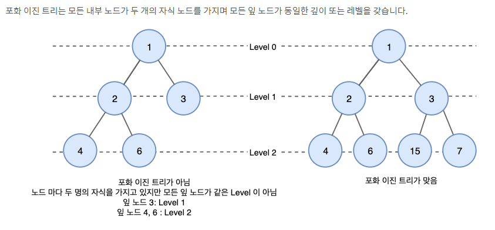
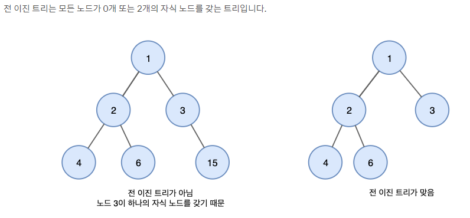
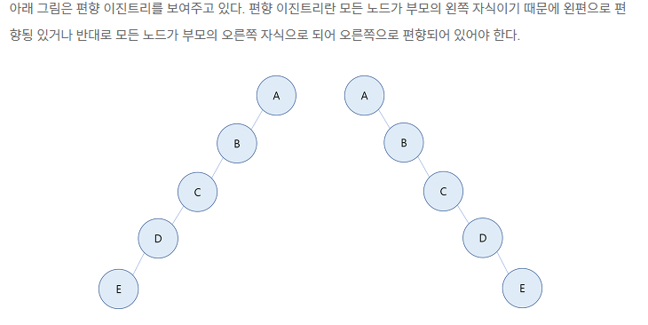

# 이진 트리(Binary Tree)

- 각각의 노드가 최대 두개의 자식 노드를 가지는 트리 자료구조
- 활용 방식
    - 검색과 정렬 : 이전 탐색 트리와 이진 힙 구현에 활용
    - 허프만 코딩 : 연관 분기 구조 위한 데이터 표현에 활용
- 이진 트리의 종류
    - 포화 이진 트리(Perfect binary tree)
    - 완전 이진 트리(Complete binary tree)
    - 정 이진 트리(Full binary tree)
    - 편향 이진 트리(Skewed binary tree)
    - 균형 이진 트리(Balanced binary tree)

## 포화 이진 트리(Perfect binary tree)

- 모든 레벨의 노드가 가득 채워져 있는 트리
- 특징
    - Leaf 노드를 제외한 모든 자식은 2개의 노드를 보유
    - 노드의 개수 : n =2^h - 1
- 트리 형태



## 완전 이진 트리(Complete binary tree)

- 마지막 레벨 전까지 노드가 가득 채워져 있고, 마지막 레빌은 왼쪽부터 순차적으로 채워져 있는 트리
- 특징
    - 배열을 사용해 효율적인 표현이 가능
    - 노드의 개수 : n < 2^h - 1
- 트리 형태


## 정 이진 트리(Full binary tree)

- 모든 노드가 0개 또는 2개의 자식 노드만 갖는 트리
- 특징
    - proper 또는 plane 이진 트리라고도 불림
    - 노드의 개수 : n ≤ 2^h - 1
- 트리 형태



## 편향 이진 트리(Skewed binary tree)

- 왼쪽 혹은 오른쪽으로 편향되게 치우져 있는 트리
- 특징
    - 각각의 높이에 하나의 노드만 존재
    - 노드의 개수 : h
- 트리 형태



## 균형 이진 트리(Balanced binary tree)

- 삽입 / 삭제가 이루어 질 때, 왼쪽 서브 트리와 오른쪽 서브 트리의 높이 차를 1 이하로 맞추는 이진 탐색 트리
- 특징
    - 서브 트리 높이 차이가 항상 1 이하로 유지
    - 균형 트리 종류 : AVL트리, Red-Black 트리, B트리, B+트리, B*트리
- 트리 형태


## 이진 트리 순회(Binary Tree Traversal)

- 각각의 노드가 최대 두개의 자속 노드를 가지는 트리 자료구조를 순회하는 방법
- 구현 메서드(method)
    - 노드 추가 : BinaryTree._insertNode(), BinaryTree.insert()
    - 전위 순회(Pre-order) : BinaryTree._preOrderTraverseNode(), BinaryTree.preOrderTraverse()
    - 중위 순회(In-order) : BinaryTree._inOrderTraverseNode(), BinaryTree.inOrderTraverse()
    - 후위 순회(Post-order) : BinaryTree._postOrderTraverseNode(), BinaryTree.postOrderTraverse()
    - 층별 순회(Level-order) : BinaryTree.levleOrderTraverse()

- Node(): value와 left, right node 저장을 위한 생성자

```jsx
function Node(value) {
  this.value = value;
  this.left = null;
  this.right = null;
}
```

- BinaryTree(): 시작 노드인 root를 저장하기 위한 생성자

```jsx
function BinaryTree() {
  this.root = null;
}
```

- _insertNode(): 재귀로 트리를 순회하며 노드 추가 (내부 사용)

```jsx
BinaryTree.prototype._insertNode = function (node, value) {
  if (node === null) {
    node = new Node(value);
  } else if (value < node.value) {
    node.left = this._insertNode(node.left, value);
  } else if (value >= node.value) {
    node.right = this._insertNode(node.right, value);
  }
  return node;
};
```

- insert(): 노드 추가

```jsx
BinaryTree.prototype.insert = function (value) {
  this.root = this._insertNode(this.root, value);
};
```

- 사용

```jsx
let tree = new BinaryTree();

tree.insert("F");
tree.insert("B");
tree.insert("A");
tree.insert("D");
tree.insert("C");
tree.insert("E");
tree.insert("G");
tree.insert("I");
tree.insert("H");

console.log(tree);
```

- 전위 순회(Pre-order)
    - 전위 순회 방법 : N - L - R
        1. 현재 노드를 방문한다.
        2. 왼쪽 서브 트리를 전위 순회한다.
        3. 오른쪽 서브 트리를 전위 순회한다.
    - 방문 순서
        - F → B → A → D → C → E → G → I → H
    - 의사 코드(pseudo-code)

```jsx
preorder(node) 
	print node.value
	if node.left ≠ null then preorder(node.left) 
	if node.right ≠ null then preorder(node.right)
```

- _preOrderTraverseNode(): 재귀로 트리를 순회하 며 전위 순회 (내부 사용)

```jsx
BinaryTree.prototype._preOrderTraverseNode = function (node, callback) {
  if (node === null) {
    return;
  }
  callback(node);
  this._preOrderTraverseNode(node.left, callback);
  this._preOrderTraverseNode(node.right, callback);
};
```

- preOrderTraverse(): 전위 순회하며 노드 출력

```jsx
BinaryTree.prototype.preOrderTraverse = function (callback) {
  this._preOrderTraverseNode(this.root, callback);
};
```

- 사용

```jsx
let tree = new BinaryTree();

tree.insert("F");
tree.insert("B");
tree.insert("A");
tree.insert("D");
tree.insert("C");
tree.insert("E");
tree.insert("G");
tree.insert("I");
tree.insert("H");

console.log(tree);

function printNode(node) {
  process.stdout.write(`${node.value} -> `);
}

console.log("********* Pre-Order ***********");
tree.preOrderTraverse(printNode);
console.log("end");
```

- 중위 순회(In-order)
    - 중위 순회 방법 : L - N - R
        1. 왼쪽 서브 트리를 중위 순회한다.
        2. 현재 노드를 방문한다.
        3. 오른쪽 서브 트리를 중위 순회한다.
    - 방문 순서
        - A → B → C → D → E → F → G → H → I
    - 의사 코드(pseudo-code)
    
    ```jsx
    inorder(node)
    	if node.left ≠ null then inorder(node.left) 
    	print node.value
    	if node.right ≠ null then inorder(node.right)
    ```
    
    - _inOrderTraverseNode(): 재귀로 트리를 순회하 며 중위 순회 (내부 사용)
    
    ```jsx
    BinaryTree.prototype._inOrderTraverseNode = function (node, callback) {
      if (node === null) {
        return;
      }
      this._inOrderTraverseNode(node.left, callback);
      callback(node);
      this._inOrderTraverseNode(node.right, callback);
    };
    ```
    
    - inOrderTraverse(): 중위 순회하며 노드 출력
    
    ```jsx
    BinaryTree.prototype.inOrderTraverse = function (callback) {
      this._inOrderTraverseNode(this.root, callback);
    };
    ```
    
    - 사용
    
    ```jsx
    let tree = new BinaryTree();
    
    tree.insert("F");
    tree.insert("B");
    tree.insert("A");
    tree.insert("D");
    tree.insert("C");
    tree.insert("E");
    tree.insert("G");
    tree.insert("I");
    tree.insert("H");
    
    console.log(tree);
    
    function printNode(node) {
      process.stdout.write(`${node.value} -> `);
    }
    
    console.log("********* In-Order ***********");
    tree.inOrderTraverse(printNode);
    console.log("end");
    ```
    
- 후위 순회(Post-order)
    - 후위 순회 방법 : L - R - N
        1. 왼쪽 서브 트리를 후위 순회한다.
        2. 오른쪽 서브 트리를 후위 순회한다.
        3. 현재 노드를 방문한다.
    - 방문 순서
        - A → C → E → D → B → H → I → G → F
    - 의사 코드(pseudo-code)
    
    ```jsx
    postorder(node)
    	if node.left ≠ null then postorder(node.left) 
    	if node.right ≠ null then postorder(node.right) 
    	print node.value
    ```
    
    - _postOrderTraverseNode(): 재귀로 트리를 순회하 며 후위 순회 (내부 사용)
    
    ```jsx
    BinaryTree.prototype._postOrderTraverseNode = function (node, callback) {
      if (node === null) {
        return;
      }
      this._postOrderTraverseNode(node.left, callback);
      this._postOrderTraverseNode(node.right, callback);
      callback(node);
    };
    ```
    
    - postOrderTraverse(): 후위 순회하며 노드 출력
    
    ```jsx
    BinaryTree.prototype.postOrderTraverse = function (callback) {
      this._postOrderTraverseNode(this.root, callback);
    };
    ```
    
    - 사용
    
    ```jsx
    let tree = new BinaryTree();
    
    tree.insert("F");
    tree.insert("B");
    tree.insert("A");
    tree.insert("D");
    tree.insert("C");
    tree.insert("E");
    tree.insert("G");
    tree.insert("I");
    tree.insert("H");
    
    console.log(tree);
    
    function printNode(node) {
      process.stdout.write(`${node.value} -> `);
    }
    
    console.log("********* Post-Order ***********");
    tree.postOrderTraverse(printNode);
    console.log("end");
    ```
    

- 층별 순회(Level-order)
    - 층분 순회 방법 : 낮은 Level부터 순차적으로 순회
        1. root 노드 방문
        2. Level 증가
        3. 왼쪽에서 오른쪽 순으로 방문
    - 방문 순서
        - F → B → G → A → D → I → C → F → H
    - 의사 코드(pseudo-code)
    
    ```jsx
    levelorder(root)
    q.enqueue(root) 
    	while not q.empty do
    	node := q.dequeue() 
    	print node.value
    	if node.left ≠ null q.enqueue(node.left) 
    	if node.right ≠ null q.enqueue(node.right)
    ```
    
    - Queue 객체 추가
    
    ```jsx
    function Queue(array) {
      this.array = array ? array : [];
    }
    Queue.prototype.isEmpty = function () {
      return this.array.length == 0;
    };
    Queue.prototype.enqueue = function (element) {
      return this.array.push(element);
    };
    Queue.prototype.dequeue = function () {
      return this.array.shift();
    };
    ```
    
    - levelOrderTraverse(): 층별 순회하며 노드 출력
    
    ```jsx
    BinaryTree.prototype.levelOrderTraverse = function (callback) {
      let q = new Queue();
      let node;
      q.enqueue(this.root);
      while (!q.isEmpty()) {
        node = q.dequeue();
        callback(node);
        if (node.left !== null) q.enqueue(node.left);
        if (node.right !== null) q.enqueue(node.right);
      }
    };
    ```
    
    - 사용
    
    ```jsx
    let tree = new BinaryTree();
    
    tree.insert("F");
    tree.insert("B");
    tree.insert("A");
    tree.insert("D");
    tree.insert("C");
    tree.insert("E");
    tree.insert("G");
    tree.insert("I");
    tree.insert("H");
    
    console.log(tree);
    
    function printNode(node) {
      process.stdout.write(`${node.value} -> `);
    }
    
    console.log("********* Level-Order ***********");
    tree.levelOrderTraverse(printNode);
    console.log("end");
    ```
