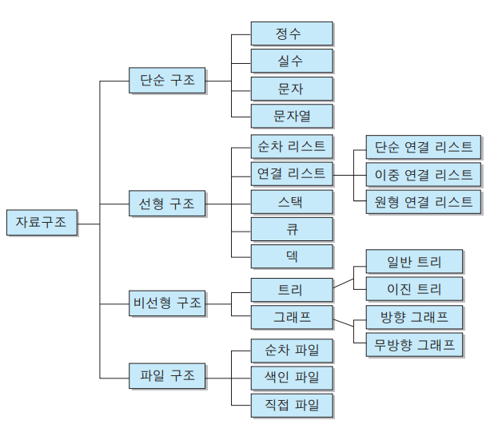

# 자료구조 개요

- 자료구조란 데이터에 편리하게 접근하고, 변경하기 위해서 **데이터를 저장하거나 조직하는 방법**.
- 모든 목적에 맞는 자료구조는 없다. 따라서 각 자료구조가 갖는 장점과 한계를 잘 아는 것이 중요하다.
- 자료구조는 언어별로 지원하는 양상이 다르다. 따라서 각각의 언어가 가진 자료구조의 사용방법도 중요하지만, 무엇보다 **각 자료구조의 본질과 컨셉을 이해하는 것**이 중요하다. 컨셉을 알고 있다면 기억해야 할 것이 현저히 줄어들게 된다.

## 자료구조의 분류

- 단순구조 : 프로그래밍에서 사용되는 기본 데이터 타입
- 선형구조 : 저장되는 자료의 전후관계가 1:1 (리스트, 스택, 큐 등)
- 비선형구조 : 데이터 항목 사이의 관계가 1:n 또는 n:m (트리, 그래프 등)
- 파일구조 : 서로 관련된 필드들로 구성된 레코드의 집합인 파일에 대한 자료구조
