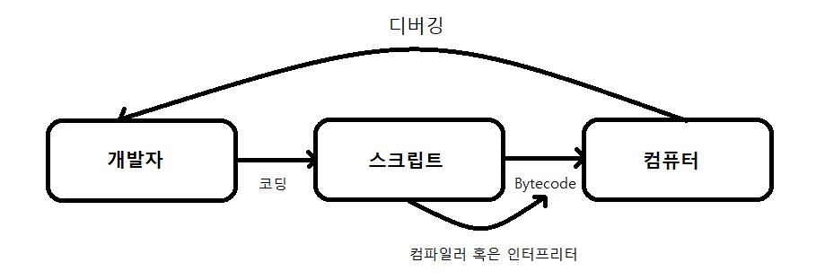
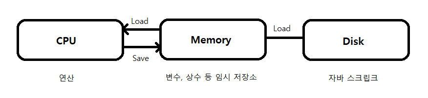
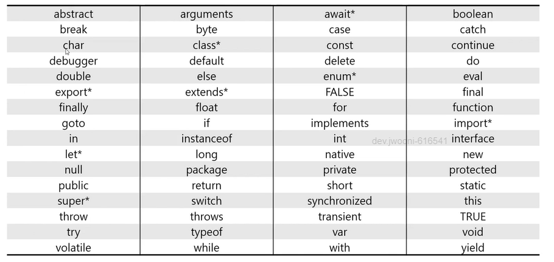
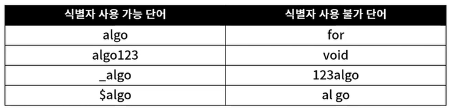

# **JavaScript 소개**
## JavaScript란?

- 객체(Object) 기반의 스크립트 프로그래밍 언어
- ECMAScript 사양을 준수하는 범용 스크립팅 언어
- 자바와 직접적인 연관은 없으며, 웹의 동적 동작을 구현하기 위해 제작
- Mocha → LiveScript → JavaScript로 명칭 변경
- JavaScript는 JS 엔진위에서 수행되며, Google V8, Firefox SpiderMonkey, Edge Chakra 존재
- 1996년 brendan Eich(브랜던 아이크)가 개발 발표한 Script 언어
- 객체기반언어 : 프로그래머가 생성하기 보다 생성된 객체들을 주고 사용하는 언어
- 동적인 데이터형 ( 값이 할당될때 데이터형이 정해지는 데이터형)
    - 개발자가 데이터형을 사용하지 않는다.
- 대수문자를 구별
- ;을 사용하지 않아도 된다.
- Script 언어 종류
    - VB Script : VB기반
    - JavaScript : C개발
- C언어로 만들어진 언어
- HTML에 정의하여 사용하는 언어
- inline, embed, external File 방식으로 사용할 수 있다.
- 줄단위로 실행하여 Error가 발상하게 된다.
- library가 많이 개발되어 있다. (JQuery, Node.js, Angular js, vue.js,,,)
- ECMA Script 262 Edition 6.
- 최상위 객체 window (생략가능)
    - window
        - document
        - history
        - location
- 모두 문자열

```html
- <body> 태그 안 출력
     window.document.write("출력할 내용");

   - 경고창 출력
     alert("출력할 내용")    //코드의 실행을 멈춘다.

    - console 출력 : 출력을 숨겨서 하거나 debugging 할 때
     console.log("메세지")
```

- **inline 방식**
    - 태그에 넣어 작성하는 방식.
    - 우선순위가 가장 높다.
    - 코드 중복성이 가장높다.
    - <태그명 on[Xxx]="코드">      // on뒤에 오는 것은 다양하다.
- **embed 방식**
    - html에 정의하는 방식

```html
<html>
     <head>
        <title> 타이틀 </title>
        <script type="text/javascript">
            코드작성
        </script>
    </head>
    <body>
     .
     .
    </body>
    </html>
```

- **external file 방식**
    - 파일을 따로 정의하여 작성하는 방식
    - js 파일을 생성하고 코드를 정의하는 방식.
    - 필요한 HTML에서 <script type='text/javascript' src="jsurl"></script>
    - JQuery 등 외부라이브러리를 사용할 때 많이 사용.


## ECMAScript란?

- Ecma International이 ECMA-262 기술 규격에 따라 정의하고 있는 표준화된 스크립트 프로그래밍 언어
- 자바스크립트를 표준화하기 위해 만들어졌으며, 액션스크립트와 J스크립트 등 다른 구현체도 표현
- Ecma International : 정보 통신에 대한 표쥰을 제정하는 비영리 표준화 기구
- ECMA-262 : Ecma International에서 제정한 기술 규격의 이름으로, 범용 목적의 스킯트 언어 명세 기술
- 97년 ES1 초판, 09년 ES5, 15년 ES2015(ES6)으로 매해 6월에 버전 갱신 중

## 코드 동작 흐름



## 컴퓨터 내부 동작 원리



# 기본 입출력 및 기본 용어

## **기본 입출력**

- 사용자 프로그램과 상호작용하기 위한 방법으로, 입력과 출력을 아우르는 개념
- Input / Output의 머리 글자를 따서 I/O로 줄여서도 표기
- 운영 체제에서의 대표적인 입출력은 "표준 입력 / 표준 출력 / 표준 오류 출력"
    - 표준 입력 (stdin)
        - 일반적으로 컴퓨터의 키보드의 응답을 받아 입력
        - 프로그램의 데이터를 추가하기 위한 입력 장치
        - 알고리즘에서는 문제의 Testcase 입력을 위해 사용
    - 표준 출력 (stdout)
        - 일반적으로 컴퓨터의 모니터에 문자열로 출력
        - 프로그램의 실행 상태 혹은 실행 결과를 보고 판단
        - 알고리즘에서는 문제의 정답 확인, 디버깅용으로 사용

## 기본 용어

### 코드 구성

- JavaScript는 문법의 대부분은 C, C++, Java로부터 차용하여 제작된 시크립트 기반의 언어
- 다수의 표현식(expression)으로 하나의 명령문(statement)이 만들어지며, 명령문으로 프로그램이 수행
- 하나의 명령문 끝은 개행 문자(Enter) 혹은 세미콜론(;)으로 표시

### 키워드

- 자바스크립트에서 문법을 만들 때 미리 정해진 용도로 동작하기 위해 정의해 놓은 단어
- 자바스크립트에 예약된 키워드 목록(*는 ES5와 ES6에 추가된 단어)



### 식별자

- 스크립트에서 변수나 함수에 이름을 붙일 때 사용하는 단어
- 대소문자를 구별하며 유니코드 문자셋을 이용
- 자바스크립트 내 시별자 규칙
    - 키워드 사용 불가
    - 숫자로 시작 불가
    - 특수문자는 _와 $만 허용
    - 공백 문자 포함 불가

    

### 주석

- 프로그램 구현 시 개발자의 설명 및 이해를 쉽게 도와주는 문장으로 실제 실행 코드에는 포함되지 않음
- 주석의 종류는 단일 행 주석// 과 다중 행 주석 /* */ 존재

```jsx
// single-line comments
// 12312344444444
console.log("Hello world!"); // 단일 행 주석

/* mulit-line comments
	어떤 문자가 와도 개행이 되어도 주석 처리가 된다.
	주석으로 인정이 된다.
	console.log("Hello world!!");
	*/
	console.log("Hello world!!");
```

# **기본문법**

- 변수
- 연산자
- 제어문 (if, else, switch ~ case, for, while, do, break, continue, return)
- 함수 (사용자정의 함수, 제작사함수), 함수 호출, 유효성 검증, popup, location, history, localStorage, sessionStorage, canvas
