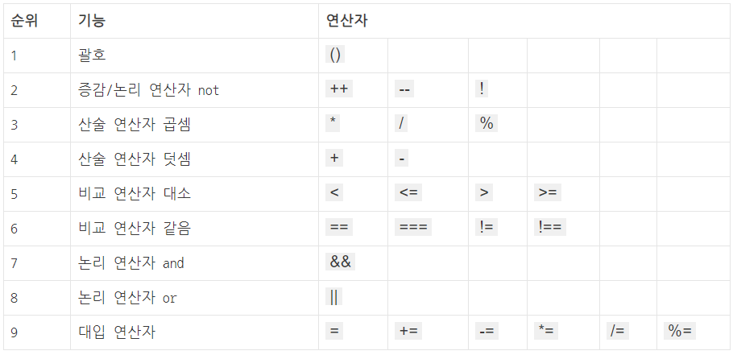

# 연산자

- 연산자는 프로그램에서 데이터를 처리하여 결과를 산출할 목적으로 사용되는 문자
- 연산의 대상 값은 피연산자라고 하며, 피 연산자의 개수에 따라 단항/이항/삼항 연산자의 종류 존재

## 연산자 우선순위



## 산술 연산자

- 수학적 계산을 위해 제공하는 연산자

```jsx
// 산술 연산자
// 덧셈 연산자: +
console.log(31 + 10); // 41 
// 뺄셈 연산자: -
console.log(31 - 10); //  21 
// 곱셈 연산자: *
console.log(31 * 10); // 310 
// 나눗셈 연산자: /
console.log(31 / 10); // 3.1 
// 몫
console.log(parseInt(31 / 10)); // 3
 // 나머지 연산자: %
console.log(31 % 10); // 1 
// 거듭제곱 연산자: **
console.log(2 ** 3); // 8
```

## 대입 연산자

- 계산한 결과를 하나의 변수에 저장하기 위한 연산자

```jsx
// 대입 연산자: =
let num_1 = 123;
let num_2 = 456;
let str_1 = "hello";
let str_2 = "world!";

let num_3, str_3;
num_3 = num_1 + num_2; 
str_3 = str_1 + str_2;

console.log(num_3); // 579 
console.log(str_3); // helloworld!

let num_4 = num_1 - num_2; 
console.log(num_4); // -333
```

## 복합 대입 연산자

- 산술 연산자로 피연산자를 계산해 결과값을 한번에 대입시켜주는 연산자

```jsx
// 복합 대입 연산자
// 대입 연산자: = 
let num = 10;
let result_1, result_2, result_3, result_4, result_5; 
result_1 = result_2 = result_3 = result_4 = result_5 = 31;

// 복합 대입 연산자: += 
result_1 += num;
console.log(result_1); // 41 

// 복합 대입 연산자: -=
result_2 -= num;
console.log(result_2); // 21 

// 복합 대입 연산자: *=
result_3 *= num;
console.log(result_3); // 310 

// 복합 대입 연산자: /=
result_4 /= num;
console.log(result_4); // 3.1 

// 복합 대입 연산자: %=
result_5 %= num;
console.log(result_5); // 1
```

## 증가 감소 연산자

- 숫자 1만큼 증가시키거나 감소시킬 때 사용되는 연산자
- 증가 연산자 : ++(피연산자), (피연산자)++;
- 감소 연산자 : —(피연산자), (피연산자)—;

```jsx
// 증가 감소 연산자
let num, result; 

num = 10;
result = num++;
console.log(result); // 10 
console.log(num); // 11

num = 10; 
result = ++num;
console.log(result); // 11 
console.log(num); // 11

num = 10; 
result = num--;
console.log(result); // 10 
console.log(num); // : 9

num = 10; 
result = --num;
console.log(result); // 9 
console.log(num); // 9
```

## 비교 연산자

- 좌항과 우항의 피연산자를 비교한 다음 결과값을 논리적 자료형으로 반환하는 연산자
- ==은 단순 값의 같음을 비교하는 동등 비교, ===는 자료형까지 같음을 판단하는 일치 비교 연산자

```jsx
console.log("Z" > "A"); // true
console.log("Hello" < "Hi"); // true
console.log("Hello" >= "Helloo"); // false
console.log("5" <= 10); // true
console.log(true == 1); // true
console.log(false != 123); // true
console.log(true === 1); // false
console.log(false !== 123); // true
```

## 논리 연산자

- 좌항과 우항의 피연산자 간 논리 값을 연산하여 참 또는 거짓을 결과로 얻는 연산자
- 논리 연산자 : &&(AND), ||(OR), !(NOT)

```jsx
console.log(true || false); // true
console.log(Boolean(0 || false)); // false
console.log(Boolean(123 || false)); // true
console.log(Boolean(123 && 0)); // false
console.log(Boolean(false && true)); // false
console.log(Boolean(true && 3)); // true
console.log(Boolean(0 && false)); // false
console.log(!false); // true
console.log(!123); // false
```
