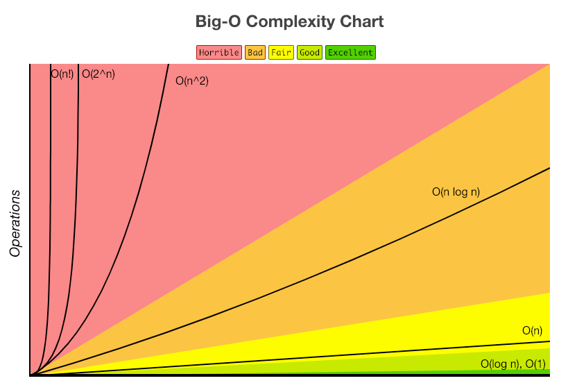

# 알고리즘 복잡도 (Algorithm complexity)

- 알고리즘 성능 평가 지표
    - 정확성
    - 작업량
    - 메모리 사용량
    - 최적성
    - 효율성
        - 시간 복잡도
        - 공간 복잡도

## 시간 복잡도

- 입력 크기의 값에 대해 단위 연산을 몇 번 수행하는지 계산하여, 알고리즘의 수행시간을 평가하는 방법
- 3가지 접근적 표현법
    - O(빅오) : 최악의 상황을 고려하여 성능 측정 결과 표현
    - Θ(세타) : 평균적인 경우에서의 성능 측정 결과 표현
    - Ω(오메가) : 최선의 상황일 때의 성능 측정 결과 표현

### Big-O

- 시간복잡도는 입력된 N의 크기에 따라 실행되는 조작의 수를 나타낸다.
- 공간복잡도는 알고리즘이 실행될때 사용하는 메모리의 양을 나타낸다.요즘에는 데이터를 저장할 수 있는 메모리의 발전으로 중요도가 낮아졌다.
- 아래는 대표적인 Big-O의 복잡도를 나타내는 표이다.

