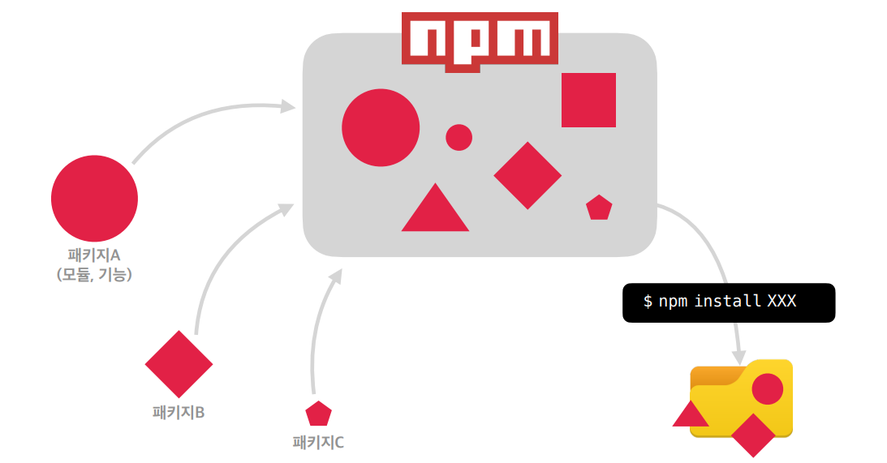

# Node.js
## Node.js란?

- Chrome V8 JavaScript 엔진으로 빌드된 JavaScript 런타임

## Node.js 설치

- [https://nodejs.org/ko/](https://nodejs.org/ko/)

## NPM

- NPM(Node Package Manager)은 전 세계의 개발자들이 만든 다양한 기능(패키지, 모듈)들을 관리
- 설치
    - MAC : [https://github.com/nvm-sh/nvm](https://github.com/nvm-sh/nvm)
    - Windows : [https://github.com/coreybutler/nvm-windows](https://github.com/coreybutler/nvm-windows)
- 개요
    - 전세계의 개발자들이 모듈, 기능들을 개발해 생태계로 업로드하는 시스템이다.
    - NPM 생태계
    
    
    
    - 설치
    
    ```jsx
    $npm install XXX
    ```
    
    - package.json 에 설치된 모듈들이 기록이 되면 node_modules 라는 폴더를 삭제해도 명령어를 통해 한번에 명시된 모듈들을 설치할 수 있다.
    
    ```
    $npm install
    ```
    
- 장단점
    - 장점 : 관리 효율이 증가하고 기능 고도화가 편리하다.
    - 단점 : 구성이 복잡하다.

### NPM 을 이용하여 프로젝트 만들기

- 초기화

```powershell
$npm init -y
```

- package.json

```json
{
  "name": "test",
  "version": "1.0.0",
  "description": "",
  "main": "index.js",
  "scripts": {
    "test": "echo \"Error: no test specified\" && exit 1"
  },
  "keywords": [],
  "author": "",
  "license": "ISC"
}
```

1. name : 프로젝트 이름
2. main :'main' 은 하나의 프로젝트를 npm 생태계에 업로드 할때 필요하다. 개인 웹사이트를 만들때는 없애줘도 된다.
3. scripts :'scripts'는 현재 프로젝트 내부에서 사용할 수 있는 여러가지 script 명령들을 내부에 명시를 해놓으면 프로젝트를 진행하면서 사용할 수 있다.

- parcel-bundler

```powershell
$npm install parcel-bundler -D
```

- package.json 파일에 parcel-bundler가 추가된 것을 확인할 수 있다.

```json
{
  "name": "test",
  "version": "1.0.0",
  "description": "",
  "main": "index.js",
  "scripts": {
    "test": "echo \"Error: no test specified\" && exit 1"
  },
  "keywords": [],
  "author": "",
  "license": "ISC",
  "devDependencies": {
    "parcel-bundler": "^1.12.5"
  }
}
```

- lodash

```powershell
$npm install lodash
```

- 개발용 의존성 패키지 설치
    - -D 를 붙여넣는다면개발용 의존성 패키지 설치를 하는것이고, 그렇지 않다면,일반 의존성 설치를 하는것이다.
    - 이 차이는개발용 의존성 패키지는 내가 직접 '개발'할때만 필요하고 웹이 동작할때는 필요가 없다는 뜻이고,일반 의존성 설치는 웹브라우저에서 동작할 수 있는 개념이다.
    
- 개발 서버 실행과 빌드
    - package.json 파일에 scripts를 추가한다.

```json
{
  "name": "test",
  "version": "1.0.0",
  "description": "",
  "main": "index.js",
  "scripts": {
    "dev": "parcel index.html"
  },
  "keywords": [],
  "author": "",
  "license": "ISC",
  "devDependencies": {
    "parcel-bundler": "^1.12.5"
  },
  "dependencies": {
    "lodash": "^4.17.21"
  }
}
```

- 서버 실행

```powershell
$npm run dev
```

- 패키지 실행

```jsx
import _ from 'lodash' // _ 변수로 사용할 수 있게 해준다.
```

- 빌드

```json
"build" : "parcel build index.html"
```
